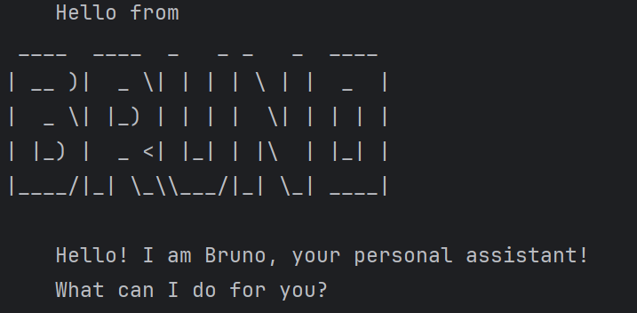

# Bruno User Guide


Bruno is a desktop task management assistant​ that helps you manage your tasks efficiently via a Command-Line Interface (CLI). It's optimized for fast typists who prefer keyboard input.
## Quick Start
1. Ensure you have Java 17 or above installed in your Computer.
2. Download the latest bruno.jar​ from the releases page.
3. Copy the file​ to the folder you want to use as Bruno's home folder.
4. Open a terminal/command prompt​ and navigate to that folder.
5. Run the application: `java -jar bruno.jar`
6. Type a command​ and press Enter to execute it.
7. Refer to the commands below for help.

## Features
1. Command words​ are case-insensitive (e.g., `list`, `LIST`...).
2. Parameters​ are specified directly after the command word, separated by spaces.
3. Indexes​ refer to the task numbers shown in the listcommand, starting from 1.
4. Search is case-insensitive.

## Viewing all tasks: list
Shows a numbered list of all your tasks.

Example: `list`
```
    Here are the tasks in your list:
    1.[T][X] read books
    2.[D][ ] homework (by: 2pm)
```
## Adding a to-do task
Adds a simple task without any date/time constraints.

Fromat: `todo DESCRIPTION`

Example: `todo read books`
```
    Got it. I've added this task:
      [T][ ] read books
    Now you have 1 tasks in the list.
```
## Adding deadlines
Adds a task with a specific due date.

Format: `deadline DESCRIPTION /by TIME`

Examples: 
1. TIME is a parable date (YYYY-MM-DD):

`deadline submit report /by 2026-03-15`
```aiignore
    Got it. I've added this task:
      [D][ ] submit report (by: Mar 15 2026)
    Now you have 2 tasks in the list.
```

2. TIME is not a parsable date:

`deadline submit report /by this sunday`

```aiignore
    Got it. I've added this task:
      [D][ ] submit report (by: this sunday)
    Now you have 3 tasks in the list.
```

## Adding events
Adds a task that occurs over a period of time.

Format: `event DESCRIPTION /from START_TIME /to END_TIME`

Example: `event meeting /from 2026-03-10 /to 2026-03-11`
```aiignore
    Got it. I've added this task:
      [E][ ] meeting (from: Mar 10 2026 to: Mar 11 2026)
    Now you have 4 tasks in the list.
```
## Marking tasks as done
Marks a specific task as completed.

Format: `mark INDEX`

Example: `mark 2`
```aiignore
    Nice! I've marked this task as done:
    [D][X] submit report (by: Mar 15 2026)
```
## Marking tasks as not done
Marks a specific task as not completed.

Format: `unmark INDEX`

Example: `unmark 2`
```aiignore
    OK, I've marked this task as not done yet:
    [D][ ] submit report (by: Mar 15 2026)
```
## Deleting tasks
Removes a task from your list.

Format: `delete INDEX`

Example: `delete 4`
```aiignore
    Noted. I've removed this task:
      [E][ ] meeting (from: Mar 10 2026 to: Mar 11 2026)
    Now you have 3 tasks in the list.
```
## Finding tasks
Searches for tasks containing a specific keyword (case-insensitive).

Format: `find KEYWORD`

Example: `find report`
```aiignore
    Here are the matching tasks in your list:
    1.[D][ ] submit report (by: Mar 15 2026)
    2.[D][ ] submit report (by: this sunday)
```
## Exiting the program: bye
Saves all your tasks and closes the application.

Example: `bye`
```aiignore
    Bye! Hope to see you again!
    Remember, Bruno is always here for you!
```
## Data Storage
Bruno automatically saves your tasks to a file (./data/bruno.txt) in the background. Your data is preserved between sessions.

Example:
```aiignore
T | 0 | read books
D | 0 | submit report | 2026-03-15
D | 1 | submit report | this sunday
E | 0 | meeting | 2026-03-10 to 2026-03-11
```
## Command Summary
| Command | Format | Example | What it does |
|---------|--------|---------|--------------|
| **List all tasks** | `list` | `list` | Shows all tasks with indexes |
| **Add a to-do** | `todo DESCRIPTION` | `todo Buy milk` | Adds a simple task |
| **Add a deadline** | `deadline DESCRIPTION /by TIME` | `deadline Homework /by 2026-03-20` | Adds a task with due date/time |
| **Add an event** | `event DESCRIPTION /from START /to END` | `event Meeting /from 2pm /to 4pm` | Adds a task with start & end times |
| **Mark as done** | `mark INDEX` | `mark 1` | Marks task as completed |
| **Mark as not done** | `unmark INDEX` | `unmark 2` | Marks task as pending |
| **Delete a task** | `delete INDEX` | `delete 3` | Removes a task permanently |
| **Find tasks** | `find KEYWORD` | `find book` | Searches task descriptions |
| **Exit Bruno** | `bye` | `bye` | Saves tasks and exits |

## Getting Help
If you encounter any issues:
1. Ensure you're using the correct command format
2. Check that task indices are valid (use `list` to verify)
3. For date inputs, use yyyy-MM-dd format for automatic formatting

Enjoy using Bruno to manage your tasks efficiently!